# Indeed job posting analysis - Data scientist

## Project Overview

This project analyzes actual data scientist job postings on Indeed in the USA from 23/06/2024 to 11/08/2024. The goal is to examine trends in job postings and salary variations across different states, experience levels, work modes, and companies. Based on this analysis, a predictive model that estimates salaries will be developed, enabling both job seekers and employers to make informed decisions and ensure fair compensation in the job market.

### Data Source
The data used in this project was downloaded from Kaggle.

- Link dataset: [Job posting dataset](https://www.kaggle.com/datasets/yusufolonade/data-science-job-postings-indeed-usa)

### Business Problem

In the competitive data science market, both job seekers and employers struggle with unclear salary expectations and job availability. The lack of comprehensive insights into job posting trends and salary variations across states and experience levels can result in misaligned expectations, affecting recruitment and job satisfaction.

This project seeks to analyze recent job postings and create a predictive model for estimating salaries in data science. By offering data-driven insights, job seekers should negotiate fair compensation while helping employers attract and retain top talent.

### Table of Contents

1. [Data cleaning](#1-data-cleaning)
2. [Exploratory Data Analysis (EDA)](#2-exploratory-data-analysis-eda)
3. [Model Development](#3-model-development)

#### 1. Data cleaning

- Explore the dataset to create new columns (such as working mode, job level, and average salary) that will aid in building the model at the end of this project.
- Address missing values, eliminate duplicates, and convert data types as needed. 
- Finally, remove any columns that are not relevant.

__Raw data__

__Clean data__

#### 2. Exploratory Data Analysis (EDA)
__Job posting by date__
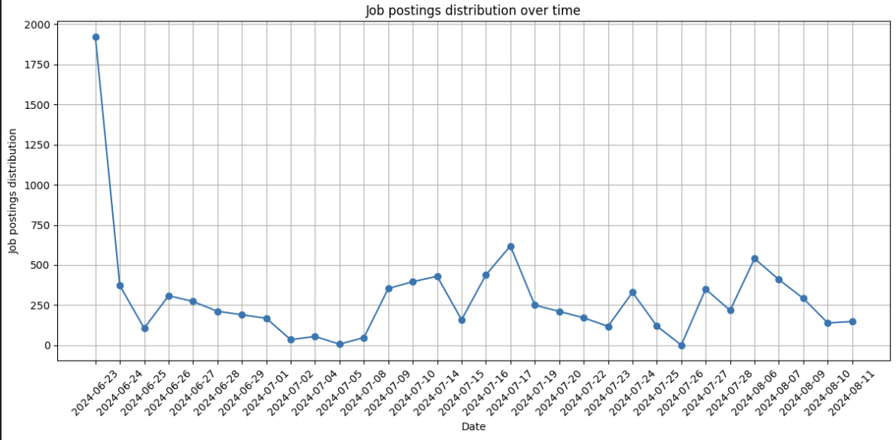
__Job distribution by state__
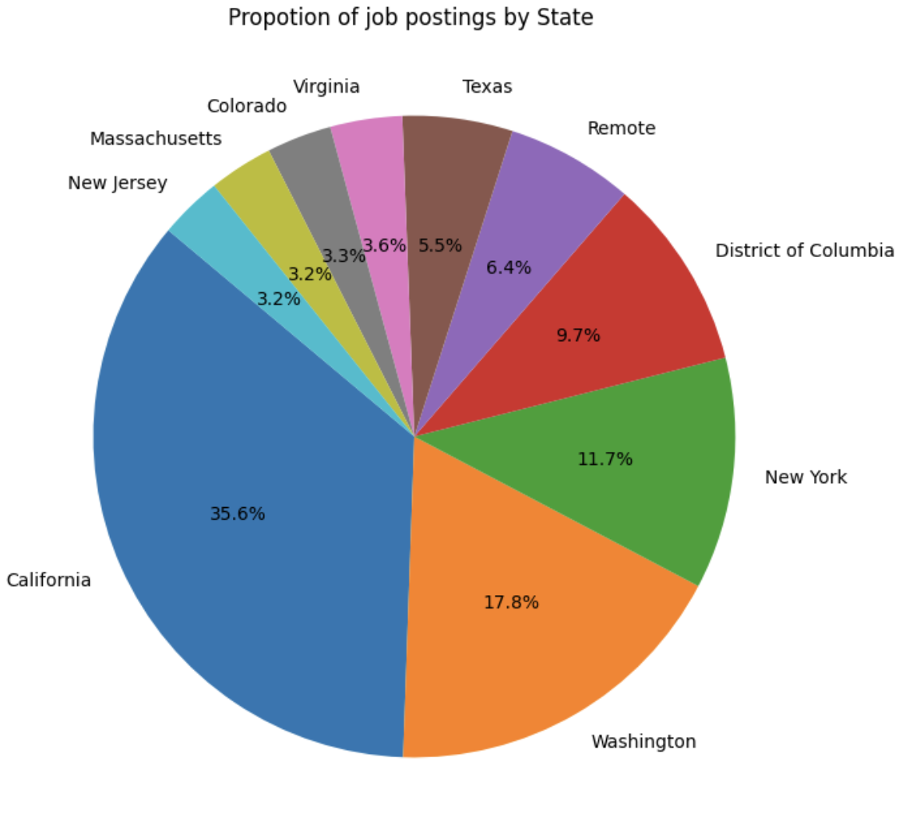
__Salary distribution__
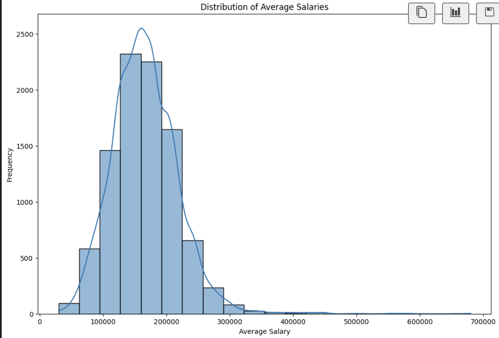
__- __Salary by job level__
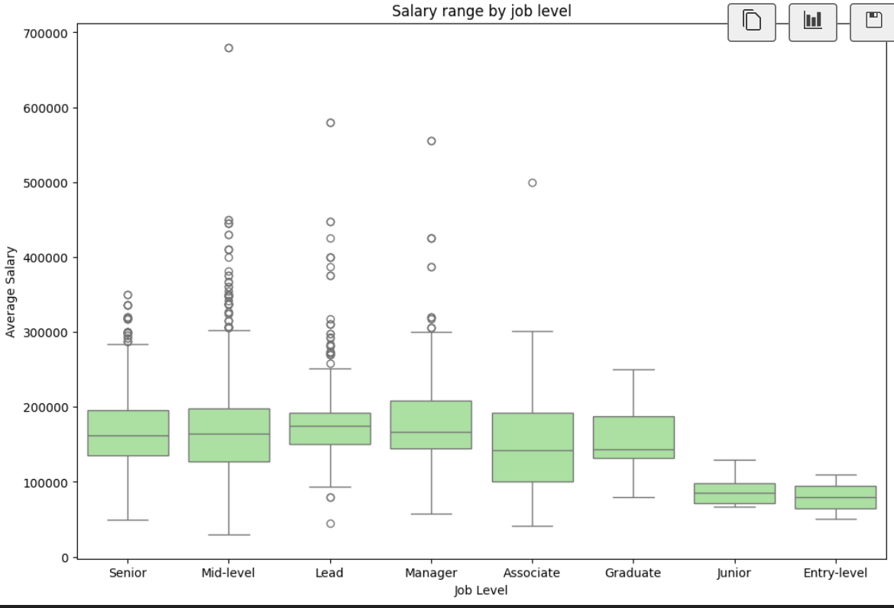
__Salary by working mode__
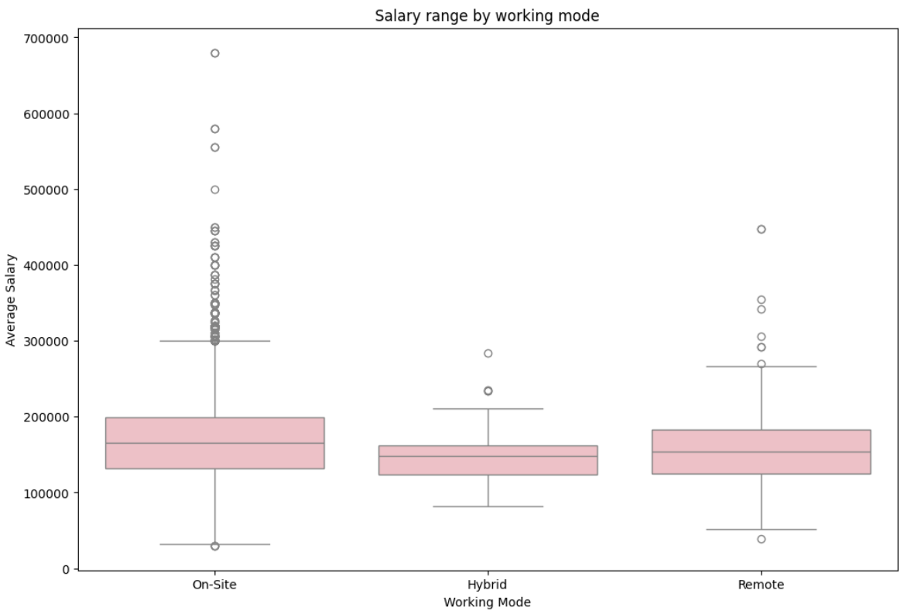
__Salary by job level and working mode__
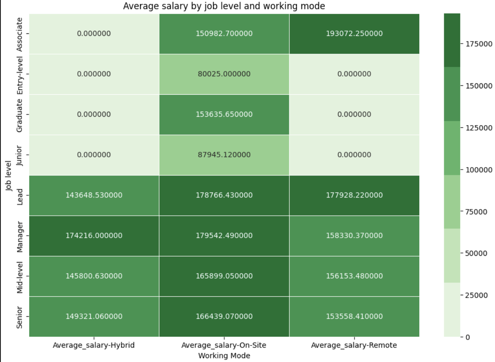
__Top 10 city, state hiring the most__
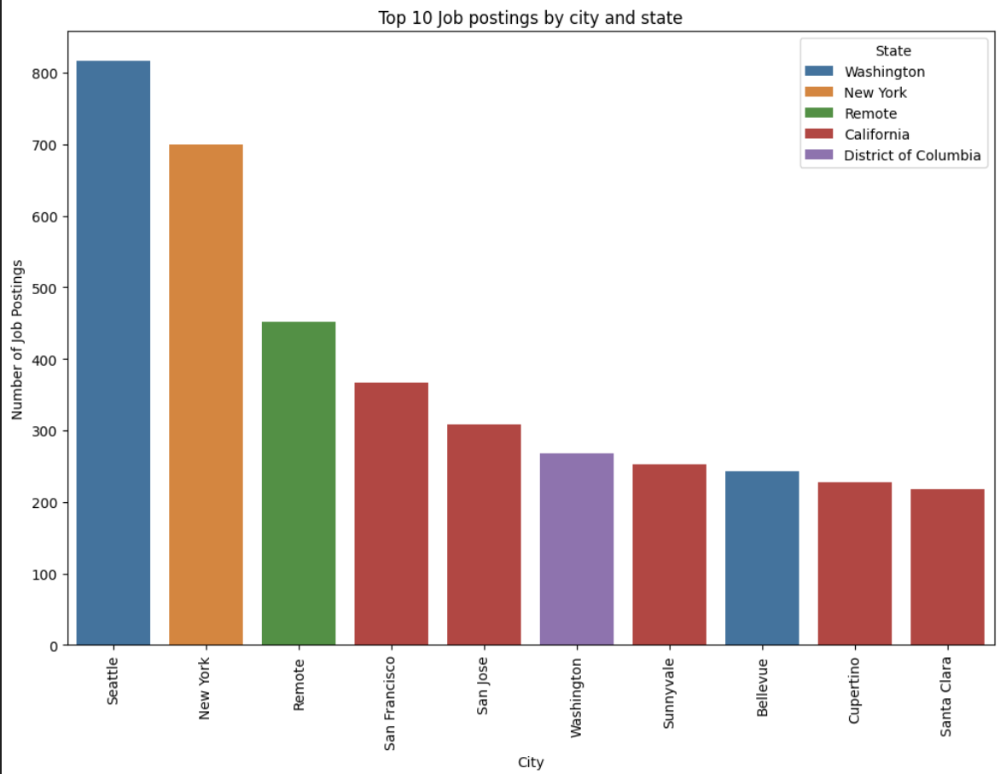
__Top 10 company actively hiring__
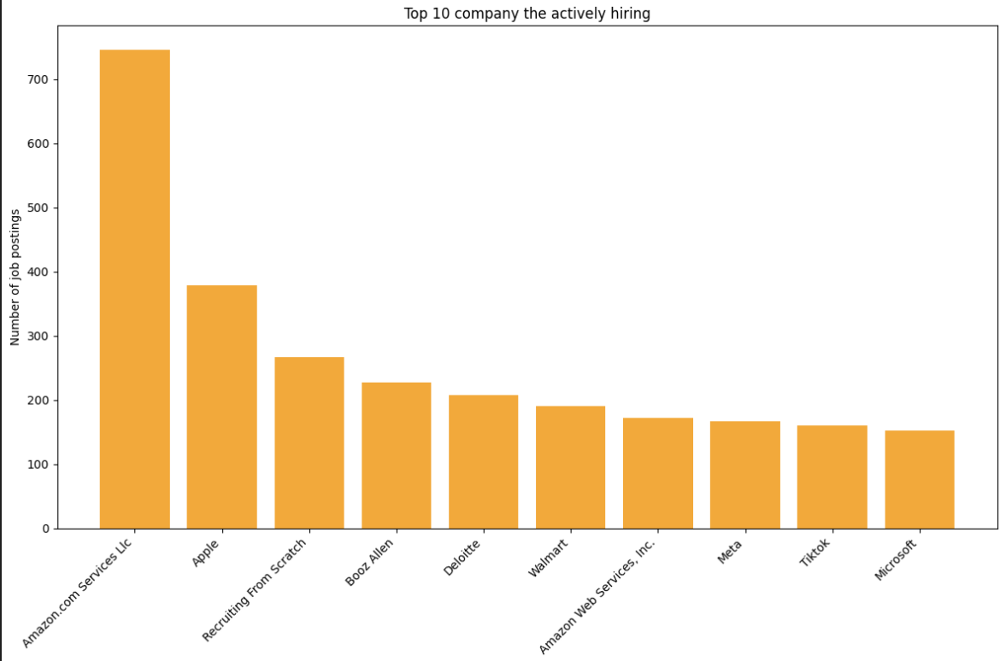
__Salary range for entry level positions__
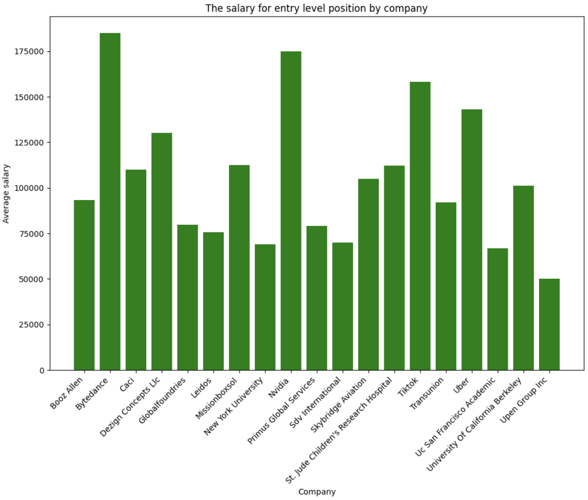

#### 3. Model development

Three models were developed to predict salary: 
__Simple Linear Regression (SLR)__
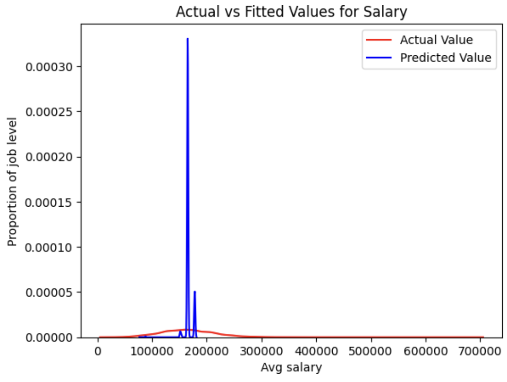
__Multiple Linear Regression (MLR)__
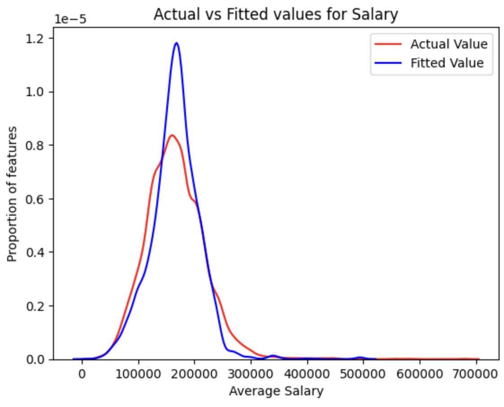
__Polynomial Regression__
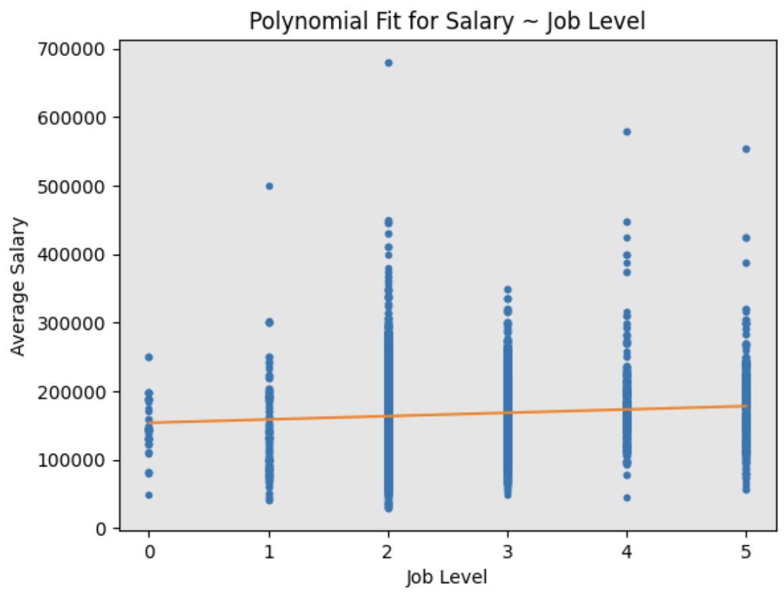

### Conclusion
- The analysis demonstrates that the multiple linear regression (MRL) model is the best choice for salary prediction. With a R-squared value and minimal MSE, this model effectively captures the complexities of various influencing factors. 

- By leveraging multiple relevant predictors, it not only enhances the accuracy of salary forecasts but also provides invaluable insights for both job seekers and employers. Investing in this approach empowers stakeholders to make informed decisions, ultimately leading to a more equitable and efficient job market.

- However, further investigation is needed to refine the model for even greater accuracy.
