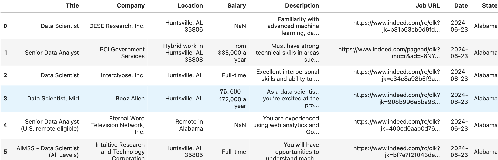
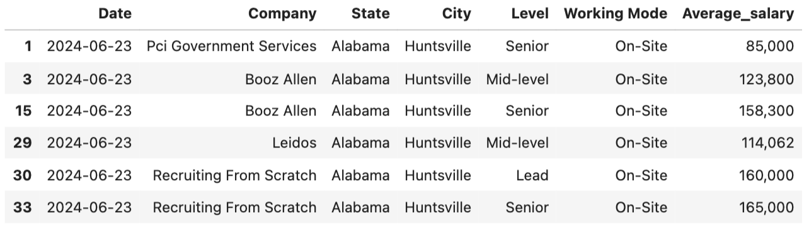

# Job Postings Analysis and Visualization

## Project Overview

- Develop an automated script to clean job posting data from Indeed. Afterward, visualize the data and build a model to predict future salaries for data scientist positions.

- The model is built using knowledge gained from the IBM Data Analyst Professional Certificate. I applied this knowledge to test its effectiveness and determine the best metric for the prediction model.

### Business Problem

The company needs to optimize its recruitment for data scientist roles by accurately predicting salary trends. Current analysis of Indeed job postings is unstructured, which can lead to misaligned salary offerings. By automating data cleaning, visualizing trends, and building a predictive model, we aim to enhance hiring competitiveness and attract top talent.

### Data Source
Data is sourced from Kaggle.

- **Dataset Link:** [Job Posting Dataset](https://www.kaggle.com/datasets/yusufolonade/data-science-job-postings-indeed-usa)

### Table of Contents

1. [Data Cleaning](#1-data-cleaning)
2. [Exploratory Data Analysis (EDA)](#2-exploratory-data-analysis-eda)
3. [Model Development](#3-model-development)

#### 1. Data Cleaning

- Automated data cleaning to create essential columns (e.g., working mode, job level, average salary).
- Handled missing values, removed duplicates, and adjusted data types.

__Raw Data__  

__Clean Data__  

#### 2. Exploratory Data Analysis (EDA)

- Visualizations include job postings by date, state distribution, and salary trends by job level and work mode.

#### 3. Model Development

- Developed three models for salary prediction:
  - **Simple Linear Regression (SLR)**
  - **Multiple Linear Regression (MLR)**
  - **Polynomial Regression**

__DATA VISUALIZATION:__ [Go to Tableau Public](https://public.tableau.com/app/profile/aimee.le9707/viz/job_posting_17304216955380/Dashboard1)

### Conclusion

This project developed a predictive model for data scientist salaries using Indeed job postings. Automation of the data cleaning process ensured accuracy by removing duplicates and handling missing values. Key salary trends were identified through visualization, and the selected metric effectively evaluated the model's performance. The model provides valuable insights for strategic hiring and salary optimization, with future enhancements planned for refinement and incorporation of additional data sources.
